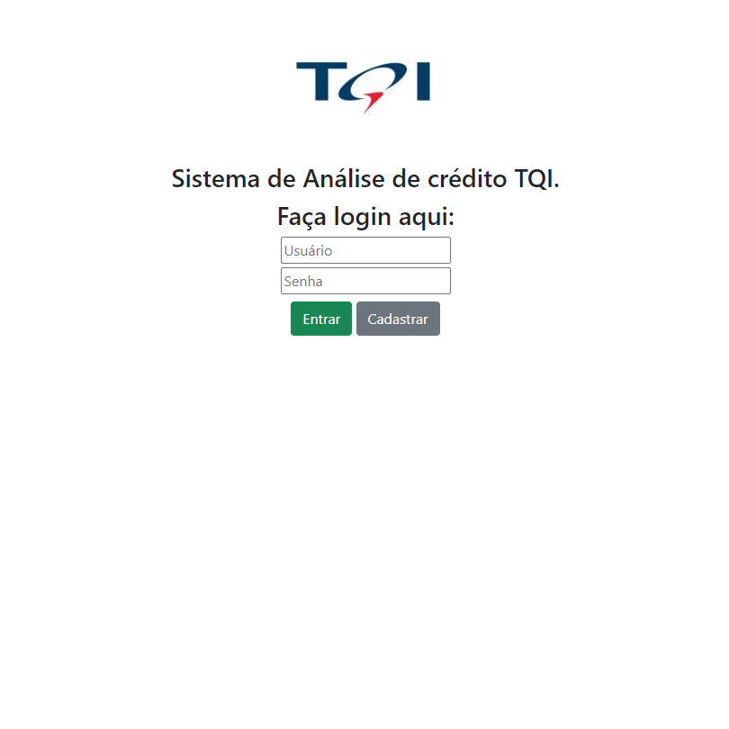
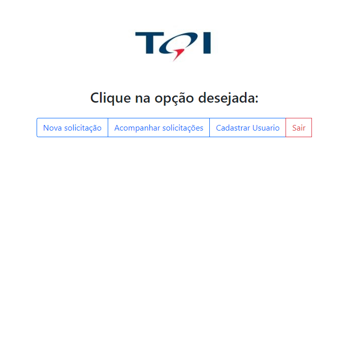
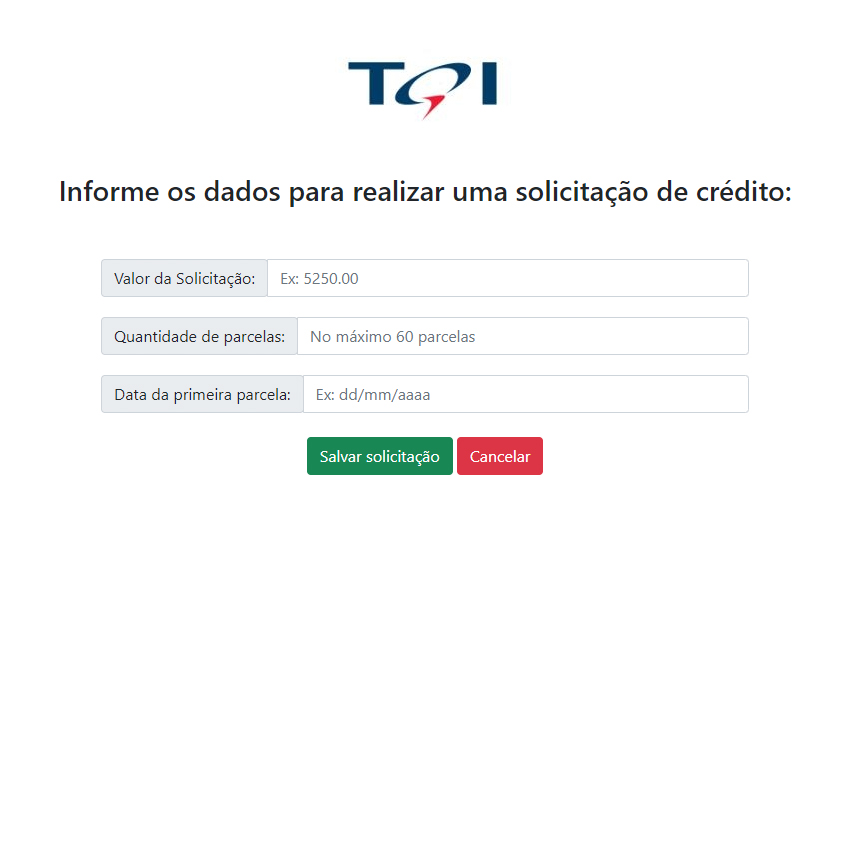
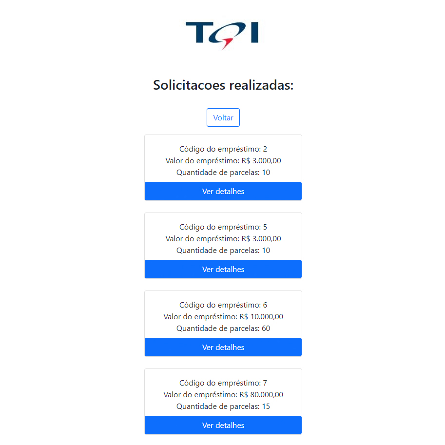

# tqi_evolution_backend_2021

# :small_blue_diamond: Aplicação MVC para cadastro de solicitação de crédito.

# :dart: Objetivo:
 Aplicação desenvolvida como solução para o desafio proposto no TQI Evolution 2022 - Back-end:

 Dado o cenário abaixo, elabore uma sugestão para o back-end necessária para resolver o problema.
Use a criatividade! Você pode explorar aqui todos os seus conhecimentos, demonstrando fluxos, telas, protótipos e/ou codificação.
É importante sabermos por que você decidiu fazer a solução, portanto deixe clara a motivação das suas escolhas.

Uma empresa de empréstimo precisa criar um sistema de análise de crédito para fornecer aos seus clientes as seguintes funcionalidades:
- I. Cadastro de clientes
    O cliente pode cadastrar: nome, e-mail, CPF, RG, endereço completo, renda e senha.
- II. Login
    A autenticação será realizada por e-mail e senha.
- III. Solicitação de empréstimo
    Para solicitar um empréstimo, precisamos do valor do empréstimo, data da primeira parcela e quantidade de parcelas.
    O máximo de parcelas será 60 e a data da primeira parcela deve ser no máximo 3 meses após o dia atual.
- IV. Acompanhamento das solicitações de empréstimo
    O cliente pode visualizar a lista de empréstimos solicitados por ele mesmo e também os detalhes de um de seus empréstimos.
    Na listagem, devemos retornar no mínimo o código do empréstimo, o valor e a quantidade de parcelas.
    No detalhe do empréstimo, devemos retornar: código do empréstimo, valor, quantidade de parcelas, data da primeira parcela, e-mail do cliente e renda do cliente.

Restrições
- 1. A implementação deve utilizar linguagem Java ou Kotlin.
- 2. Use todos os seus conhecimentos adquiridos no bootcamp para explorar bem a solução. Não se preocupe, porque não existe certo ou errado. Só queremos conhecer um pouco mais sobre você.
- 3. Utilize o GitHub para repositório de código.

[**Clique aqui para testar!**](https://tqi-evolution-backend-2021.herokuapp.com/login)

# 🦾 Motivações:
Por em prática os conteúdos vistos durante o Bootcamp TQI Java Developer com certeza foi uma das maiores motivações para o desenvolvimento deste projeto. Além da solução de backend, também foiimplementada uma simples interface gráfica para facilitar o consumo e visualização da aplicação.

# 📺 Screenshots:

    
    
    
    

# 🛠️ Ferramentas utilizadas:
◀️Back-End
- Java 11
- SQL
- Maven
- Spring Boot
- Spring JPA
- Spring Security

▶️Front-End
- Thymeleaf
- HTML
- Bootstrap
- Heroku 

# 🟡 Observações:

O banco de dados da aplicação está configurado como H2 Database atualmente para facilitar o teste da aplicação, porém, um banco de dados SQL pode ser configurado alterando o arquivo application.properties.

